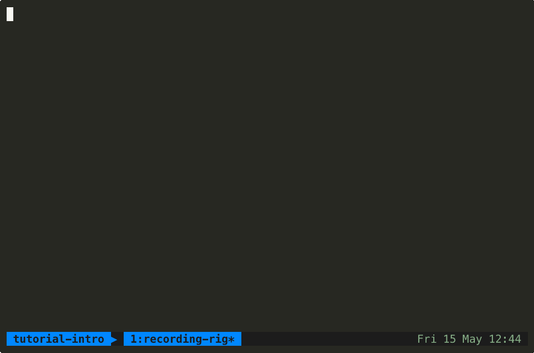
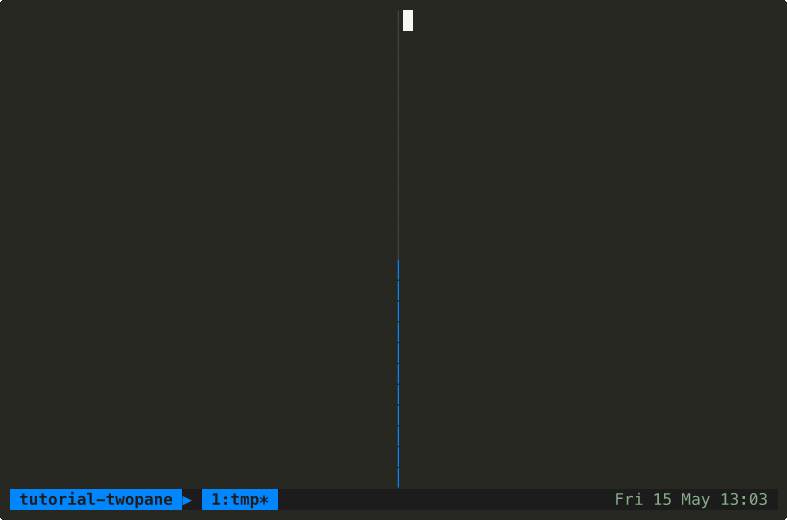
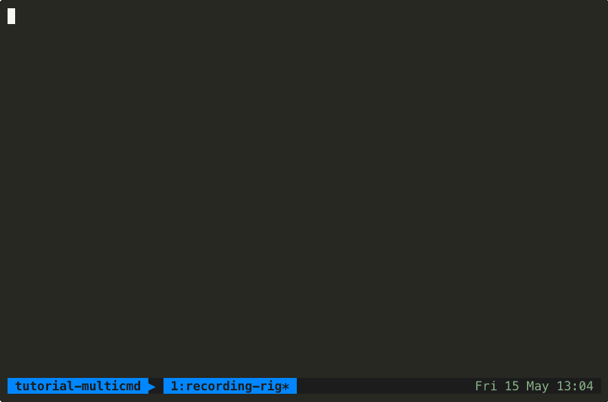

# recording-rig

A reusable, language-agnostic framework for recording deterministic Claude Code sessions —
tutorials, demos, screencasts, regression fixtures, anything you want repeatable.
Hook-driven coordination, no TUI scraping. See [`docs/design.md`](docs/design.md) for the rationale.


### Getting started — single-pane



> Agent runs `doctor.sh`, lists `examples/`, cats a spec. Spec: [`test-runs/tutorial-intro.json`](test-runs/tutorial-intro.json).

### Gated path — auto-answer `AskUserQuestion`


> Agent calls `AskUserQuestion` with `['production', 'staging', 'dev']`; rig sends `Down + Enter` to pick option 2 (`staging`); agent confirms `DEPLOY_TARGET-K7Q=staging`. `must_not_contain` blocks the other two answers, so the gate-navigation mechanism is provable end-to-end. Spec: [`test-runs/tutorial-gated.json`](test-runs/tutorial-gated.json).

### Two-pane path — companion observer subscribed to a hook sentinel



> Agent uses Bash to emit `JOB_ID=…`; `PostToolUse[^Bash$]` hook extracts it to a sentinel; companion `node observer.mjs` (right pane) waits on the sentinel, reads `JOB_ID` from env, prints lifecycle ticks. Spec: [`test-runs/tutorial-twopane.json`](test-runs/tutorial-twopane.json); observer: [`test-runs/observer.mjs`](test-runs/observer.mjs).

### Multi-command path — `agent.commands[]` across turns



> Three sequential prompts; rig deletes `turn-end` before each paste so per-command idle detection works. `must_contain_in_order` enforces strict reply ordering. Spec: [`test-runs/tutorial-multicmd.json`](test-runs/tutorial-multicmd.json).

## Quick start — as a Claude Code plugin

This repo is also a Claude Code plugin. Install it once and the rig becomes available
as skills and slash commands in any project:

```
/recording-rig:doctor                 verify prereqs
/recording-rig:author [out.json]      interactively author a spec
/recording-rig:record path/spec.json  run a recording
/recording-rig:diagnose <session>     forensics on a failed run
```

The skills (`record`, `author-spec`, `doctor`, `diagnose`) also trigger on natural prose
like "make a gif of this skill" or "diagnose my failed rig run".

## Quick start — as standalone scripts

```bash
# 1. Verify prereqs
bin/doctor.sh

# 2. Write a spec
cp examples/single-pane.json my-recording.json
$EDITOR my-recording.json

# 3. Record
bin/record.sh my-recording.json

# Outputs:
#   /tmp/<session>.cast   (lossless asciinema cast)
#   /tmp/<session>.gif    (agg-rendered GIF; only if validation passes)
```

## What the rig gives you

- **Hook-driven coordination.** A generated `--settings` file installs lifecycle hooks
  (`UserPromptSubmit`, `Stop`, `PreToolUse[AskUserQuestion]`, `PostToolUse`, `SessionStart`)
  that drop sentinel files. The driver watches sentinels, not pane text.
- **Multi-turn idle detection.** The `Stop` hook touches a `turn-end` sentinel every turn.
  Idle = mtime hasn't moved for N seconds. Works uniformly for single-turn and multi-turn flows.
- **Multi-command tutorials.** `agent.commands[]` runs commands in sequence; gates can target
  specific commands via `gates[].for_command`.
- **Reliable gate handling.** `AskUserQuestion` gates are handled by ordered gate decisions in
  the spec. The driver navigates to option N via (N−1) `Down` keypresses then `Enter`, holding
  for pre/post-Enter seconds for readability.
- **Consent sweep.** Before recording, an auxiliary tmux session (not captured) dismisses
  Claude's two interactive consent dialogs (`--dangerously-skip-permissions` legal accept;
  per-workspace trust). Skip with `SKIP_CONSENT_SWEEP=1`. This is the only place the rig
  does TUI screen-scrape, and it's outside the recorded window.
- **Autonomous termination.** Driver sends `/exit` (falling back to `C-c` + `C-d`) when work is
  done so the tmux pane dies, asciinema returns, and the recording completes without manual
  intervention. A backstop in `record.sh` also kills the session once the `agent-done` sentinel
  has been present long enough.
- **Two-pane lockstep (optional).** A companion pane can subscribe to backend state via
  sentinels emitted by the agent's `PostToolUse` hook. One drives, the other observes.
- **Validation gate.** Before rendering the GIF, parse the cast (ANSI/CSI escapes stripped) for
  required positive signals, optional in-order signals, and forbidden failure markers. Refuse
  to render on mismatch (override with `SKIP_VALIDATE=1`).

## Spec format

A tutorial is one JSON file. Fields:

```jsonc
{
  "session": "my-tutorial",            // [A-Za-z0-9._-]+; auto-generated if absent

  "agent": {
    // Either:
    "command": "/my-skill arg1",       // single slash command (or prose)
    // Or:
    "commands": ["/cmd-a", "/cmd-b"],  // sequence of commands across turns
    "cwd": ".",                        // working dir for `claude`; resolved to absolute path
    "extra_args": [],                  // extra args passed to `claude`
    "bypass_permissions": false        // pass --dangerously-skip-permissions
  },

  "hooks": {
    "capture_tools": [                 // PostToolUse matchers — each drops a sentinel
      {
        "name": "project-id",          // sentinel filename suffix
        "matcher": "^mcp__.*__start_research$",
        "jq": ".project_id // .projectId"
      }
    ]
  },

  "gates": [                           // ordered AskUserQuestion answers
    {
      "wait_for": "gate-pending",      // "turn-end-idle" | "gate-pending" | "<sentinel-name>"
      "answer_index": 1,               // 1-based option index; driver sends (N-1) Down + Enter
      "pre_enter_sec": 5,              // hold before Enter (readability)
      "post_enter_sec": 2,             // hold after Enter (resolution on camera)
      "for_command": "/cmd-a"          // optional: only consume after this command
    }
  ],

  "companion": {                       // optional second pane
    "command": "node",                 // executable (program name only when args[] is set)
    "args": ["my-observer.js"],        // optional; argv passed safely (%q-quoted) — use for
                                       //   any command with spaces, quotes, or shell metas
    "wait_for_sentinels": ["project-id"],
    "env": { "SUBSCRIBE_TO": "$project-id" }   // $name resolves /tmp/${SESSION}.name at spawn
  },

  "validate": {
    "must_contain": ["Research complete"],
    "must_contain_in_order": ["Phase 1", "Phase 2", "done"],   // optional ordering check
    "must_not_contain": ["step_aborted", "failure_reason"]     // defaulted if absent
  },

  "pacing": {
    "idle_seconds": 8,                 // Stop-mtime idle threshold (turn-end stable for N s)
    "turn_timeout_sec": 120,           // per-turn ceiling: if turn-end never progresses for this
                                       //   long, abort (Stop hook may not be firing)
    "session_max_sec": 1800,           // absolute upper bound on a single sentinel_wait_idle call
    "attach_gap_sec": 3,               // wait after asciinema start before driver pastes
    "agent_done_hold_sec": 4,          // kill-session backstop after agent-done
    "exit_hold_sec": 8,                // hold final frame before kill-session
    "tmux_size": "180x50"
  },

  "render": {                          // agg styling
    "font_size": 22,
    "line_height": 1.3,
    "theme": "monokai"
  }
}
```

Only `agent.command` or `agent.commands[0]` is required; everything else has sane defaults.
Preflight (in `record.sh`) rejects: bad SESSION characters, missing commands, and any
`companion.env` `$sentinel` reference not listed in `companion.wait_for_sentinels`.

### Desktop backend (`backend: "desktop"`)

macOS only. Instead of driving the `claude` CLI inside tmux, the desktop backend
AX-drives the **Claude Desktop** app (an isolated `Claude-Rig` profile) and captures the
window with ScreenCaptureKit. The model calls back through the bundled MCP **bridge**
(`rig_checkpoint` / `rig_turn_end` / `rig_ask` / `rig_emit`), which writes the sentinels
and a transcript; there is no asciinema cast. Requires the bridge `.mcpb` installed **and
enabled** in the `Claude-Rig` profile (see `docs/design.md`).

```jsonc
{
  "backend": "desktop",                // "cli" (default) | "desktop"
  "surface": "chat",                   // TOP-LEVEL. which Desktop surface to drive:
                                       //   "chat" | "code"  → mcp-bridge (full gates/checkpoints)
                                       //   "cowork"         → agent-transcript-tail (no gates)
  "session": "rig-example-desktop-chat",
  "agent": { "command": "Reply with a one-sentence friendly greeting." },

  // Prepended to the FIRST command pasted into the composer — Claude.app has no
  // system-prompt CLI flag, so this is how the model learns to call the rig tools.
  // LEAD with "load the Recording Rig Bridge tools first": newer Claude.app (observed
  // v1.8555.2) lazy-loads extension tools, so a prologue that only says "call
  // rig_checkpoint" yields ZERO rig_* calls. Use a plain task request; a "you are
  // being recorded" framing trips injection-resistance (see docs/design.md).
  "system_prompt_prologue": "First, load the Recording Rig Bridge tools (rig_checkpoint, rig_turn_end) so they are available. Then write your greeting, immediately call rig_checkpoint with name \"greeted\", and as your final step call rig_turn_end.",

  "desktop": {
    "checkpoints": [                   // named rig_checkpoint calls to assert in the transcript
      { "name": "greeted", "required": true }   // required:true ⇒ must appear, in this order,
    ]                                            //   or validation FAILs and no GIF renders
  },

  "validate": {
    // For desktop, must_contain / must_contain_in_order / must_not_contain run against the
    // raw bridge-transcript JSONL (structured tool calls), NOT a rendered cast. The desktop
    // branch ALSO asserts every required checkpoint appears in order and the last call is
    // rig_turn_end. must_not_contain defaults to empty for desktop (the CLI terminal-error
    // markers don't map to the transcript).
    "must_contain": ["greeted"],
    "must_not_contain": []
  },

  "pacing": {
    "idle_seconds": 8,
    "turn_timeout_sec": 120,           // if the model skips rig_turn_end, record.sh synthesizes
                                       //   a fallback after this (a "soft miss"; logged for trend)
    "attach_gap_sec": 15,              // larger than CLI: wait for the cold app launch + attach
    "exit_hold_sec": 8,
    "tmux_size": "1280x800"            // reused as the recording WxH (W×H pixels)
  }
}
```

Desktop-specific behavior:

- **Artifacts**: `/tmp/${SESSION}.mov` (raw capture) → `.mp4` + `.gif` (rendered on validate-pass
  via `bin/render-webm.sh`), plus `/tmp/${SESSION}.bridge-transcript.jsonl`.
- **Soft miss**: if the model produces output but never calls `rig_turn_end`, the run still
  completes (synthesized fallback + GIF) and is recorded in
  `~/Library/Application Support/recording-rig/quality.jsonl`. `bin/doctor.sh` warns when the
  soft-miss rate exceeds 20% over the last 20 desktop runs (instruction drift).
- **No competing Claude.app** (`rr-re6`): recording requires that no *other* Claude.app instance is
  running. macOS activates per app-bundle, so a second instance keeps the foreground when
  `open -n -a Claude` launches the `Claude-Rig` instance — the Rig window stays backgrounded and its
  accessibility tree never materializes (the driver then times out). `record.sh` refuses while a
  non-Rig Claude.app main is running; `doctor` warns. Quit your primary Claude.app before recording,
  or set `RIG_ALLOW_COMPETING_CLAUDE=1` to override.
- **`gates[]`** work as in CLI, answered via the bridge's `rig_ask`.
- **Diagnose**: `/recording-rig:diagnose <session> [spec]` runs `bin/diagnose-desktop.sh` —
  checkpoint coverage, soft-miss trend, capture coverage, and bridge-log liveness.
- **Surfaces & coordination**: Chat and Code use the **bridge** (`rig_*` tools → transcript);
  CoWork uses **agent-transcript-tail** (turn-end is the `{"type":"result"}` line in the
  session `audit.jsonl`). CoWork can't surface `rig_ask`, so `record.sh` preflight-rejects any
  spec that puts `gates[]` or a `required` checkpoint on it (rather than silently dropping them).
- **Example specs**: `examples/desktop-chat.json`, `examples/desktop-code.json`,
  `examples/desktop-cowork.json` — one per surface, each recorded 10× clean in the Phase 4 gate.

#### One-time manual setup (per `Claude-Rig` profile)

The bridge and the Code working folder are **not** scriptable end-to-end; do these once:

- **Enable the bridge connector.** The `recording-rig-bridge.mcpb` must be both installed *and*
  **enabled** in the `Claude-Rig` profile's Connectors UI. An installed-but-disabled bridge looks
  exactly like the lazy-load miss — the model makes **no** `rig_*` calls and the run fails with an
  empty transcript. (Needed for Chat/Code; CoWork doesn't use the bridge.)
- **Select the Code working folder once.** The Code surface needs a working folder chosen in its
  native "Open folder…" panel, which is **not** AX-drivable. The choice persists in the profile, so
  it's a one-time step. `desktop.trusted_folders` only pre-seeds *trust* (it writes
  `localAgentModeTrustedFolders` in the profile `config.json`); it does **not** select the folder.

## Architecture

```
record.sh                                              // entry point
  ├─ preflight (tools, spec sanity, env↔wait coherence)
  ├─ render-hooks.sh   // spec → claude --settings file (jq, no sed on JSON body)
  ├─ sentinel_clear_all
  ├─ tmux-session.sh   // spawn detached tmux, optional split for companion pane
  │     ├─ pane 0: claude --settings=<rendered-hooks> [--dangerously-skip-permissions]
  │     └─ pane 1: <companion command, env sourced from /tmp/${SESSION}.companion-env>
  ├─ watcher (background) // exit on all-panes-dead OR agent-done + hold
  ├─ asciinema rec (background, attached to session)
  ├─ ATTACH_GAP_SEC sleep so asciinema is capturing before the first keystroke
  ├─ driver.sh         // paste each command, navigate gates, send /exit
  ├─ validate.mjs      // strip ANSI, check must_contain + order + must_not_contain
  └─ agg               // render GIF iff validation passes (params from spec.render)
```

## Prerequisites

`tmux`, `jq`, `asciinema`, `agg`, the `claude` CLI logged in, Node 20+ (for the validator).
Plus whatever your tutorial's own stack needs. Run `bin/doctor.sh` to verify.

The **desktop backend** additionally needs (macOS): `ffmpeg` (render), `swiftc` (builds
`bin/desktop-driver`), the Claude Desktop app, the bridge `.mcpb` installed + enabled in the
`Claude-Rig` profile, and Accessibility + Screen Recording permission. `gifski` is optional
(higher-quality GIFs). `bin/doctor.sh` checks all of these.

## See also

- [`docs/design.md`](docs/design.md) — design rationale and failure modes.
- `examples/single-pane.json` — minimal one-pane tutorial.
- `examples/two-pane.json` — lockstep agent + companion.
- `examples/gated.json` — `AskUserQuestion` gates.
- `examples/desktop-chat.json` — desktop backend (Chat surface) with a required checkpoint.
