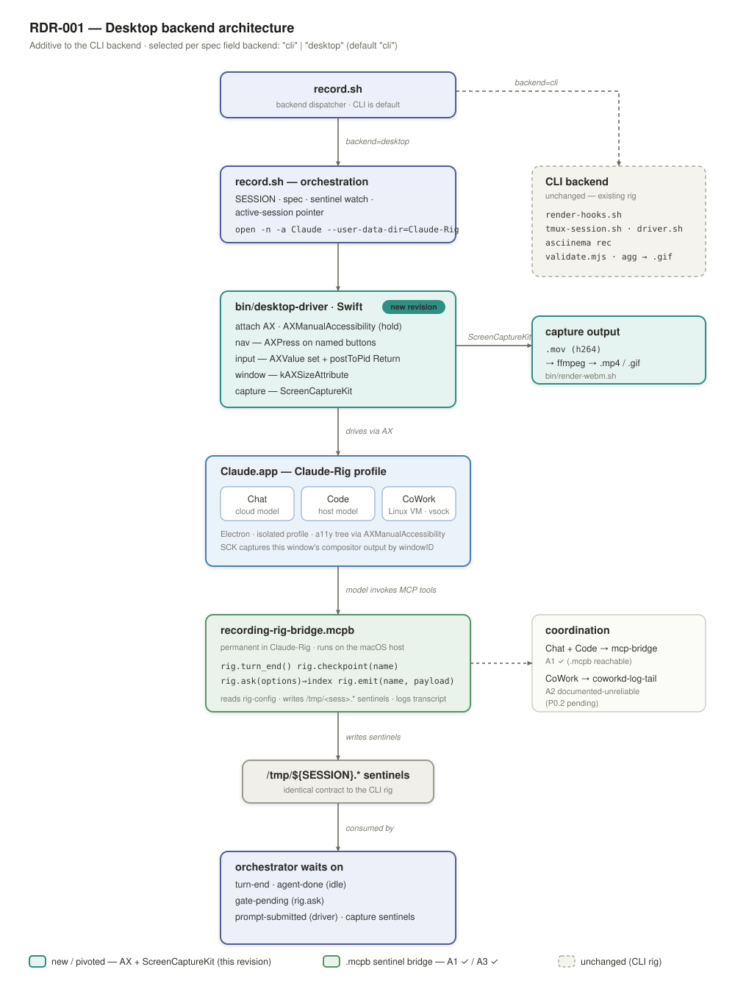

# Deterministic recording rig for Claude Code sessions

A reproducible pipeline for capturing scripted, end-to-end recordings driven by Claude Code (tutorials, demos, screencasts, regression fixtures — anything you want repeatable). The recording technology itself (tmux + asciinema + agg) is the boring part. The load-bearing innovation is using Claude Code's **lifecycle hooks** as the coordination backbone instead of scraping the TUI for state.

This document is the green-field design. It supersedes prior tutorial-pipeline notes and assumes nothing about previous attempts.

## Process model

The rig uses a **dedicated tmux socket** (`tmux -L recording-rig`) for every session it spawns. This means:

- The rig never collides with the user's normal tmux server (`tmux ls` stays clean during recordings).
- The rig can be invoked from inside an existing tmux session — including, in principle, recording itself.

The rig also supports **sandbox-HOME isolation** for the recorded child session: set `HOME` to a tmpdir with selective symlinks back to `~/.claude/` (everything except `plugins/`, `skills/`, `agents/`, and `CLAUDE.md`), and the recorded claude only sees plugins loaded explicitly via `--plugin-dir`. Useful for "clean tutorials" where you don't want the user's ambient extensions visible in the GIF. See `test-runs/meta-rig-runner.sh` for the symlink layout.

### One caveat about nesting

Direct rig invocation under sandbox HOME works end-to-end. **However**, invoking the rig from inside another `claude` session's `Bash` tool currently does not complete: `asciinema rec` requires a PTY, and the Bash tool runs commands without a controlling terminal. The `script -q /dev/null bash ...` wrapper partially helps but doesn't fully resolve it. This means a tutorial about the rig itself, recorded by the rig, requires the recorded session to invoke `/recording-rig:record` via a slash-command-and-skill path that ultimately runs in a tmux-allocated PTY, not via the Bash tool subprocess. Future work.

## Core insight: hooks, not TUI scraping

Every prior attempt at scripted Claude demos failed for the same reason: the driver tried to detect agent state by polling `tmux capture-pane -p` and matching cue strings — spinner glyphs, "esc to interrupt" banners, busy participles. This is pinned against drift on multiple axes:

- The Claude Code spinner glyph rotates through `✶ ✢ ✻ ✳ ✽`; a snapshot lands on the wrong frame and misses.
- "esc to interrupt" appears and disappears in mid-redraw.
- The past-tense `✻ Cooked for 1m 37s` summary lingers after the turn ends, trapping a busy-check forever.
- The busy-text participle is drawn from a 90-word dictionary that is **runtime-reconfigurable via a Statsig flag** (see the [tengu_spinner_words leak](https://github.com/levindixon/tengu_spinner_words)). Anything you match against today can change tomorrow.

The fix: Claude Code 2.x supports `--settings` with lifecycle hooks (`UserPromptSubmit`, `Stop`, `PreToolUse`, `PostToolUse`, `SessionStart`). Hooks fire from claude's lifecycle, not its rendered TUI. They don't drift. They emit structured stdin to a shell command, which we use to drop file sentinels under `/tmp/${SESSION}.*` that the driver and any companion processes watch.

End-state: **zero pane-text matching in the recorded session**. The one exception is a pre-recording **consent sweep** in an auxiliary tmux session (not captured by asciinema) that dismisses Claude's two interactive consent dialogs on first-run-per-machine and first-run-per-cwd. Those dialogs block `SessionStart` from firing and cannot be bypassed via command-line flags; bounded one-shot screen-scrape in a non-recorded pane is the pragmatic fix and the only TUI matching the rig does.

## Validator scope and limitations

`validate.mjs` concatenates the cast's `o` (output) events into one string, strips ANSI/CSI/OSC escapes plus control bytes, then runs `must_contain` / `must_contain_in_order` / `must_not_contain` set checks. It is **not** a terminal emulator. Two failure modes follow:

- **Ghost text from cursor-overwritten content.** A progress line redrawn in place (e.g. `Working… 1s` → `Working… 2s` → `…`) leaves all variants in the concatenated string. `must_not_contain: ["Error:"]` could false-fail on a brief "Error: connecting…" that was overwritten by "Connected ok"; conversely `must_contain` could pass on content that was visible for one frame.
- **Line-split content from terminal wrapping.** A long string that wraps across the right margin can split mid-character in the cast — `must_contain` won't find it if the cast happens to insert a control sequence at the wrap point.

For most "did the agent produce a final answer" checks this is fine. For strict assertions about screen state, embed your assertion target on its own non-overwritten line (the rig's recommended pattern is to ask the agent to emit a sentinel string like `ANSWER=42` on a fresh line).

## Architecture

```
┌──────────────────────────────┐    ┌──────────────────────────────┐
│ tmux pane: interactive claude│    │ tmux pane: companion process │
│   --settings=hooks.json      │    │   (optional, observer-only)  │
└──────────┬───────────────────┘    └──────────┬───────────────────┘
           │ lifecycle events                  │ polls sentinels
           ▼                                   ▼
       hook scripts ──► /tmp/${SESSION}.* sentinel files ◄── driver
                                ▲
                                │ tmux send-keys (paste-buffer for
                                │ slash commands, Enter for gates)
                            driver.sh
```

Three lanes of work, all keyed off `${SESSION}`:

1. **The driver** orchestrates the recording: clears stale sentinels, starts the tmux session with `asciinema rec` wrapping `tmux attach`, pastes the slash command into the agent pane, watches sentinels to know when to press Enter on `AskUserQuestion` gates, watches `turn-end` mtime for idle detection, kills the session after an N-second hold, then runs the validator and `agg` to render the GIF.
2. **The hooks** fire from claude's lifecycle and write small files. No parsing of agent output by the driver.
3. **The companion pane** (when present) observes backend state via the same sentinels — never drives state itself. This solves the "two consumers racing on one backend" problem cleanly: one drives, the other subscribes.

## The hooks that do the load-bearing work

Generate `recording-hooks.json` per-session from a template with `__SESSION__` substituted. Three hooks are sufficient for most tutorials; two more clean up the last TUI scrapes if needed.

### `UserPromptSubmit` — "agent has started a turn"

```jsonc
{ "command": "touch /tmp/${SESSION}.prompt-submitted" }
```

A companion pane (or external observer) waits for this file before starting its own work so both panes' visible output lands in sync.

### `Stop` — "agent finished a turn"

```jsonc
{ "command": "touch /tmp/${SESSION}.turn-end" }
```

Fires at the end of **every** turn. A multi-turn flow (`/foo` that calls `AskUserQuestion`, user answers, agent continues) fires `Stop` multiple times in one recording. The driver does not count turns; it watches `mtime` and declares the agent idle when `turn-end` hasn't moved for 8 consecutive seconds. That criterion handles single-turn and multi-turn flows uniformly.

### `PostToolUse` — "agent just produced a piece of state we want"

```jsonc
{
  "matcher": "^mcp__.*__start_research$|^mcp__plugin_conductor_engine__research$",
  "command": "jq -r '.tool_response | (if type==\"array\" then .[0].text else . end) | fromjson | (.project_id // .projectId // empty)' | tr -d '\\n' > /tmp/${SESSION}.project-id"
}
```

This is where most of the rig's hard-won knowledge lives. Three things will bite you:

1. **Matcher semantics: exact-string OR regex, by content sniff.** Observed behaviour (not documented): if the matcher contains only `[A-Za-z0-9_|]+` it is treated as an exact-string OR-list (e.g. `"Bash|Edit"`). Anything with parens, dots, or anchors flips it to JavaScript regex. Treat this as how the current Claude Code build behaves; verify when upgrading.

2. **Anchor your regex.** A naive `mcp__.*__research` will match `research_result` and `research_status`. The final tool call in a flow (often `*_result`) will overwrite your sentinel with empty. Always use `^...$`.

3. **The stdin field is `tool_response`, not `tool_result`, AND its shape varies by MCP transport.**
   - HTTP-transport MCP servers (e.g. routed through a remote MCP proxy) deliver `tool_response` as **an array of MCP content blocks**: `[{"type":"text","text":"{\"projectId\":\"...\"}"}]`, often with camelCase field names.
   - stdio-transport MCP servers deliver `tool_response` as **a JSON-encoded string** of the structured payload, often with snake_case field names.
   - Handle both with the `if type=="array" then .[0].text else . end | fromjson` pattern. Always `tr -d '\n'` before writing or downstream consumers that interpolate the sentinel will get a value with a glued-on newline.

### Optional extras for zero TUI scraping

- `PreToolUse` matcher `AskUserQuestion`: drop a sentinel when the agent is about to open a gate. Lets the driver press Enter on the gate without polling for the question text.
- `PostToolUse` on the next phase's start tool: phase-boundary sentinels for the companion pane.
- `SessionStart`: auto-dismiss the BypassPermissions warning so the recording doesn't open on a modal. The last commonly-needed TUI-text scrape disappears with this.

## Driving the agent pane

`claude -p` (non-interactive) **does not work** for any flow that uses `AskUserQuestion`: under `-p` there is no UI to surface the gate, claude returns a default response that most skills interpret as "decline", and the flow halts at Phase 1. Use **interactive `claude`** inside tmux instead.

The driver needs `tmux send-keys` for exactly two things now that hooks handle state:

1. **Pasting the slash command.** Use `tmux load-buffer` + `tmux paste-buffer`, not `send-keys -l`. `send-keys -l` drops characters on long inputs. The buffer route is reliable. (Pattern from the [interactive-tmux-claude gist](https://gist.github.com/Hellblazer/4a7d73baa4409e02af7af222023b8b9d).)
2. **Pressing Enter at `AskUserQuestion` gates.** Trigger off the `PreToolUse` sentinel (or, if you skip that hook, off the gate-question text). Hold the question on screen for `GATE_PRE_ENTER_SEC` seconds so viewers can read it, send `Enter`, hold `GATE_POST_ENTER_SEC` more so the accept resolves on camera.

Everything else — "is the agent done", "has the agent produced X", "should the companion pane proceed" — is sentinel-driven.

## Sentinel-file contract

All under `/tmp/${SESSION}.*`. Clear all of them at session start so a stale sentinel from a previous take cannot fire early.

| File | Written by | Consumed by |
|---|---|---|
| `prompt-submitted` | `UserPromptSubmit` hook | Companion pane start signal |
| `turn-end` | `Stop` hook | Driver idle detection (mtime watch) |
| `<artifact-id>` (e.g. `project-id`) | `PostToolUse` on relevant tool | Companion pane subscribe target |
| `gate-<name>-passed` | Driver, after pressing Enter on a gate | Companion pane, to advance phase |
| `gate-<name>-pending` (optional) | `PreToolUse` on `AskUserQuestion` | Driver, to know when to press Enter |

The sentinels are append-only within a session. Lifecycle is "create at session start, write during, delete at next session start". No locking, no message format — presence and mtime carry all the information.

## Recording stack

- **tmux** for the session. `remain-on-exit on` keeps dead panes visible for the final frame. A watcher polls `pane_dead`, then `kill-session`s after an N-second hold so the cast captures the resolved final state. Run with `-e KEY=VALUE` to pass env into pane wrappers.
- **asciinema rec** wrapping `tmux attach`. Lossless cast, ground truth.
- **agg** renders cast → GIF. Use `--idle-time-limit 4` to clip silent gaps in the rendered GIF to 4s (the underlying cast remains lossless). Without this cap, recordings with backend latency (LLM round-trips, polling waits) sit on dead screen for most of their length.
- **`validate-recording.mjs`** runs after the cast closes and before `agg`. Parses the cast for failure markers (`step_aborted`, `failure_reason`, missing positive content signals) and refuses to render the GIF if anything trips. Override with `SKIP_VALIDATE=1` only for known-good edge cases where the validator's positive-signal list lags a new render template.

**Pacing knobs worth exposing as env**: `AGG_IDLE_TIME_LIMIT`, `GATE_PRE_ENTER_SEC` (default 5s), `GATE_POST_ENTER_SEC` (default 2s), and any per-tutorial banner-hold equivalents.

## Coordinating two panes that share backend state

When a tutorial needs to show two consumers of the same backend in lockstep (e.g. an agent-driven flow on the left and a deterministic script on the right against the same MCP server), the shape that works is:

**Agent drives state. Companion observes state. They share one backend resource (project, session, job), coordinated by sentinels.**

The companion never calls `start_*`. It waits for the agent's `PostToolUse` hook to drop the resource ID, then runs a "resume" / "subscribe" variant of the flow that polls status and renders results without re-driving state. This gives you:

- No worker-queue serialization race (only one `start_*` per backend ID).
- No state-machine 409s from double-driving.
- Both panes wait on the same backend state and advance in lockstep — the wall-clock equivalence is structural, not negotiated.

Things that **don't** work and have been ruled out:

- **Sentinel-delayed companion start.** Solves phase 1 sync but nothing past it; subsequent phase boundaries drift.
- **Pre-feeding `yes\nyes` to a companion's own prompts.** The input buffers before the companion starts running; the prompt never actually waits.
- **Running the companion under `claude -p` for gated flows.** Same `AskUserQuestion` failure as the agent pane.

## Desktop backend (Claude.app / Claude-Rig)

The CLI rig's determinism rests on two affordances Claude Code gives and the Claude *desktop app* does **not**: lifecycle hooks (`--settings`) and a PTY. The desktop backend (`backend: "desktop"`, macOS only) records the desktop app's Chat, Code, and CoWork surfaces, where neither exists. It is strictly additive — every desktop change lives inside the `backend == "desktop"` arm of `record.sh`, and the CLI flow stays byte-identical (`examples/cli-smoke.json` is the deterministic regression probe).



Three pieces stand in for the missing affordances:

- **AX driving** instead of `tmux send-keys`. The Swift `bin/desktop-driver` sets `AXManualAccessibility` on the app (held for the process lifetime — the flag alone is insufficient), navigates surfaces with `AXPress` on named buttons, sets the composer via `kAXValueAttribute`, and submits with a **process-targeted** `CGEvent(...).postToPid(rigPid)` Return. A global `CGEvent.post(tap:)` leaks keystrokes to whatever is focused and is forbidden.
- **ScreenCaptureKit** instead of asciinema. SCK captures the window's compositor output by `windowID` to an h264 `.mov`, rendered to `.mp4` + `.gif` by `bin/render-webm.sh`. The CLI cast/`agg` path is untouched.
- **The `recording-rig-bridge.mcpb`** instead of hooks. The bridge is an MCP extension permanently installed in the Claude-Rig profile, exposing `rig_turn_end`, `rig_checkpoint`, `rig_ask`, `rig_emit`. The model calls them at named beats and the bridge writes the **same** `/tmp/${SESSION}.*` sentinels the CLI hooks write — `record.sh`'s idle watch does not know which backend produced the `turn-end`.

### The determinism gap (acknowledged)

The CLI rig's coordination is **structural**: hooks fire from claude's lifecycle whether or not the model cooperates. The desktop bridge's coordination is **behavioral**: the sentinels exist only because the model *chose* to call the bridge tools. That is a weaker guarantee, and it is the central honest caveat of this backend.

We narrow the gap; we do not close it:

- The `system_prompt_prologue` (prepended to the first composer paste — Claude.app has no system-prompt flag) instructs the model to call the bridge tools at the right beats. Framing is a plain task request, never "you are being recorded".
- `validate.mjs` refuses to render on a missing turn-end or absent transcript — a session where the model ignored the bridge **never publishes**. It does not synthesize a false pass from an empty transcript.
- A soft miss (model skipped `rig_turn_end` but the transcript is otherwise present) is logged to `quality.jsonl`, and for `mcp-bridge` a fallback turn-end is synthesized so the run completes with a warning instead of hanging.

The success metric, as for the CLI rig, is **re-take rate**: the RDR-001 Phase 4 gate is 10 clean runs per surface (30/30), zero re-takes.

### Coordination providers

Surface coordination is provider-polymorphic, resolved per `desktop.surface`:

| Surface | Provider | Turn-end signal | Gates / checkpoints |
|---|---|---|---|
| Chat | `mcp-bridge` | `rig_turn_end` in the bridge transcript | full (`rig_ask`, required checkpoints) |
| Code | `mcp-bridge` | same | full |
| CoWork | `agent-transcript-tail` | first `{"type":"result"}` in the session `audit.jsonl` (after a baseline-epoch guard) | **none** — no `rig.ask` reaches the Linux VM |

`mcp-bridge` is a byte-identical passthrough to the CLI idle watch. `agent-transcript-tail` tails `<profile>/local-agent-mode-sessions/<acct>/<org>/local_<sess>/audit.jsonl`; the originally-planned `coworkd-log-tail` was **disproven by a live probe** — `coworkd.log` carries transport lifecycle events but no per-turn signal. Because fallback providers cannot surface `rig.ask` or assert required checkpoints, `record.sh` **preflight-rejects** any spec that puts `gates[]` or `desktop.checkpoints[].required` on a fallback surface, rather than silently dropping them.

### Cost-of-learning gotchas (Desktop-specific)

Like the CLI `PostToolUse` matcher semantics, these are observed against a specific app build and must be **re-verified on a Claude.app upgrade**.

- **The app lazily loads MCP extension tools (observed v1.8555.2 / Electron 41.6.1).** Newer Claude.app does not pre-inject an extension's tools into the model context; the model must *load the integration* before it can call its tools ("Loaded tools, used Recording Rig Bridge integration"). A prologue that merely says "call `rig_checkpoint`" produces **zero** `rig_*` calls — the model answers and never loads the bridge. The prologue must lead with an explicit "**load the Recording Rig Bridge tools first**". Earlier app versions pre-injected the tools, so this is an upgrade-surfaced regression (bead rr-yfj).
- **The bridge must be installed *and* enabled.** Install is a file-drop into the profile's `extensions-installations.json`; enablement is a per-profile toggle (Connectors UI, recorded as `isEnabled` under `Claude Extensions Settings/<id>.json`). A bridge that is installed but disabled looks exactly like the lazy-load miss (no `rig_*` calls) — verify both before a run.
- **The Code surface needs its working folder pre-selected once.** The native "Open folder…" panel (`NSOpenPanel`) is **not AX-drivable**. The selection persists in the profile, so it is a one-time manual setup; the `desktop.trusted_folders` seed (written into `config.json`'s `localAgentModeTrustedFolders`) handles *trust*, not *selection*. Driver-side auto-selection is deferred.
- **One Claude-Rig instance at a time.** Two instances against the same profile make the driver attach to the wrong window and stall — it surfaces as "stuck at the folder picker". `record.sh` waits for any prior main instance to quit before launching its own; a stalled desktop run should first check for a stray `--user-data-dir=…/Claude-Rig` process.

## Failure modes worth remembering

- **"DONE banner present, ship it" is insufficient.** A wrap script that prints `DONE` unconditionally will mask silent aborts. The validator must check **positive content signals** (specific expected substrings in the agent's output), not just the trailing banner.
- **`readline/promises.question()` does not handle consecutive calls cleanly in Node.** Creating a fresh readline per prompt closes stdin between prompts and the second gets EOF; sharing one readline hits a Node bug where the second `question()` hangs on a buffered line. If a companion script needs to read multiple stdin prompts, hand-roll a buffered line reader on `'data'` / `'end'` events, lazy-initialized (eager init keeps the stdin handle in Node's event loop and prevents exit on scripts with zero prompts).
- **Option-value type coercion silently aborts flows.** If a select-step's option template yields a number (e.g. `account_id: 12345`) but the engine's validator requires `choice` to be a string, the step aborts with no visible error. Accept string-or-number and compare via `String()` coercion while preserving the original type so downstream tool args still see the source type.

## What this enables

Once the rig is in place, a tutorial becomes data: a sequence of `(slash-command, gate-decisions, expected-positive-signals)` tuples. Re-recording after a UX change is a single command. Adding a new tutorial is a new blueprint plus a new validator signal list, not a new pipeline.

The same pattern generalizes to any pair of MCP clients that target the same backend state, recording or not — a "subscribe and render" companion is the headless form of the right-hand pane.

## Implementation skeleton

```
docs/tutorial/recording/
  hooks.json.tmpl              # the three (or five) lifecycle hooks
  driver.sh                    # paste slash command, watch sentinels, press Enter on gates
  tmux-session.sh              # spawn tmux, wire wrappers, --record / --gif modes
  validate-recording.mjs       # cast → pass/fail before agg
  blueprints/                  # per-tutorial: command, gates, expected signals
```

Per-tutorial inputs the driver consumes:

- the slash command(s) to paste
- the ordered gate-decisions (which `AskUserQuestion` answer to send, with optional hold timings)
- the positive content signals the validator must see in the final cast
- the sentinel artifact IDs to watch (for two-pane tutorials)

Everything else is generic.

## Prerequisites

`tmux`, `jq`, `asciinema`, `agg`, the `claude` CLI logged in, plus whatever the tutorial's own stack requires (Node, Python, Docker, an MCP server, etc.). The rig itself has no dependency on the tutorial's domain — it only depends on Claude Code's hook surface.
